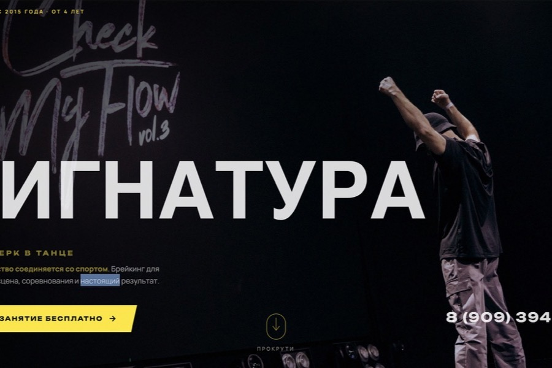
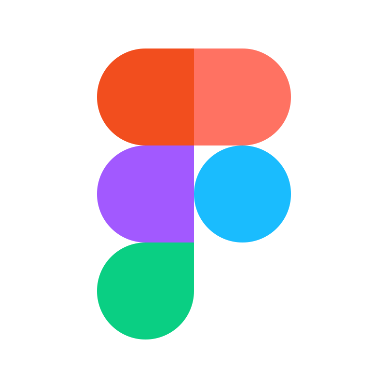

<h1 align="center">Yana Harcourt</h1>

  <b>UX/UI Designer</b> · Web & Product Design

  
  

  I design interfaces that feel effortless — from case-study concepts to fully shipped websites.
  Currently building and refining <a href="https://yanaharcourt.dev">yanaharcourt.dev</a>.

 

<h3>&nbsp; Featured work</h3>

<table>
  <tr>
    <td width="50%">
      
      <b><a href="https://yanaharcourt.dev/Paragliding/">Innsbruck Paragliding</a></b> 
      Tandem-flight booking site — concept to live product
    </td>
    <td width="50%">
      
      <b><a href="https://yanaharcourt.dev/JustName/signatura-case-study.html">Signatura</a></b> 
      Breaking-school brand & booking experience
    </td>
  </tr>
  <tr>
    <td width="50%">
      
      <b><a href="https://yanaharcourt.dev/Aura/Aura.html">Aura</a></b> 
      Bipolar companion app — mental-health product design
    </td>
    <td width="50%">
      
      <b><a href="https://yanaharcourt.dev/English-Play/englishplay.html">EnglishPlay</a></b> 
      Language-learning platform
    </td>
  </tr>
</table>

<a href="https://yanaharcourt.dev/all-work.html"><b>See all projects →</b></a>

 

<h3>&nbsp; Tools & craft</h3>

<table>
  <tr>
    <td align="center" width="14%"> Figma</td>
    <td align="center" width="14%"> Webflow</td>
    <td align="center" width="14%"> Adobe XD</td>
    <td align="center" width="14%"> Zeplin</td>
    <td align="center" width="14%"> Notion</td>
    <td align="center" width="14%"> Slack</td>
    <td align="center" width="14%"> GitHub</td>
  </tr>
</table>

 

<h3>&nbsp; GitHub activity</h3>

  

 

<h3>&nbsp; Let's connect</h3>

  &nbsp;&nbsp;&nbsp;
  &nbsp;&nbsp;&nbsp;
  &nbsp;&nbsp;&nbsp;
  

